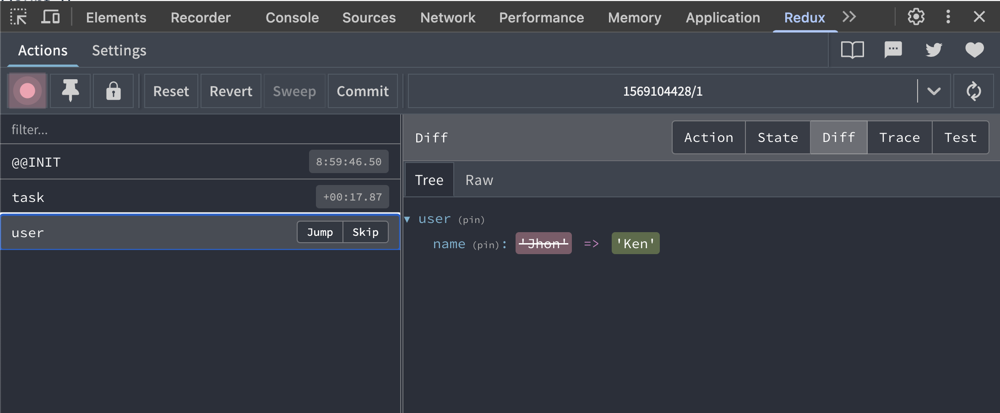

# redux-lite

[简体中文](README.zh-CN.md)

[](https://www.npmjs.com/package/@oldbig/redux-lite)
[](LICENSE)


**A lightweight, zero-dependency, type-safe state management library for React.**

`redux-lite` offers a modern, simple, and highly performant state management solution, designed to provide an excellent developer experience with TypeScript. Unit testing your components is now unimaginably easy.

## Core Features

- **🚀 Zero-Dependency**: Extremely lightweight with no third-party runtime dependencies (only `react` as a peer dependency).
- **⚡️ High Performance**: Avoids unnecessary re-renders by design through smart value comparisons.
- **✨ Simple & Intuitive API**: A minimal API that is easy to learn and use.
- **🔒 Fully Type-Safe**: End-to-end type safety, from store definition to dispatchers, with excellent autocompletion.
- **✅ Unbelievably Easy Testing**: A flexible provider makes mocking state for unit tests trivial.
- **🐞 DevTools Ready**: Optional, zero-cost integration with Redux DevTools for a great debugging experience.
- **🔌 Middleware Support**: Extend functionality with custom middlewares, similar to Redux.

## Installation

```bash
npm install @oldbig/redux-lite
# or
yarn add @oldbig/redux-lite
# or
pnpm add @oldbig/redux-lite
```

## Getting Started

### 1. Define your initial store

Create a `storeDefinition` object. This single object is the source of truth for your entire state structure and types.

```typescript
// store.ts
import { initiate, optional } from '@oldbig/redux-lite';

export const STORE_DEFINITION = {
  user: {
    name: 'Jhon' as string | null,
    age: 30,
  },
  // Use `optional` for state slices that might not exist
  task: optional({ 
    id: 1,
    title: 'Finish redux-lite',
  }),
  counter: 0,
};

export const { ReduxLiteProvider, useReduxLiteStore } = 
  initiate(STORE_DEFINITION);
```

### 2. Wrap your app with the `Provider`

In your main application file, wrap your component tree with the `ReduxLiteProvider`.

```tsx
// main.tsx
import React from 'react';
import ReactDOM from 'react-dom/client';
import App from './App';
import { ReduxLiteProvider } from './store';

ReactDOM.createRoot(document.getElementById('root')!).render(
  <React.StrictMode>
    <ReduxLiteProvider>
      <App />
    </ReduxLiteProvider>
  </React.StrictMode>,
);
```

### 3. Use the hook in your components

Use the `useReduxLiteStore` hook to access state slices and their corresponding dispatchers. The hook returns a flattened object containing all state properties and type-safe dispatcher functions.

```tsx
// MyComponent.tsx
import { useReduxLiteStore } from './store';

const MyComponent = () => {
  // Destructure state and dispatchers
  const { 
    user, 
    counter,
    dispatchUser, 
    dispatchPartialUser, 
    dispatchCounter 
  } = useReduxLiteStore();

  return (
    <div>
      <h2>User: {user.name}</h2>
      <p>Counter: {counter}</p>

      {/* Full update */}
      <button onClick={() => dispatchUser({ name: 'Ken', age: 31 })}>
        Set User
      </button>

      {/* Partial update */}
      <button onClick={() => dispatchPartialUser({ age: 35 })}>
        Update Age
      </button>

      {/* Functional update with access to the full store */}
      <button onClick={() => dispatchPartialUser((currentUser, store) => ({ age: currentUser.age + store.counter }))}>
        Increment Age by Counter
      </button>
    </div>
  );
};
```

## API

### `initiate(storeDefinition, options?)`

The sole entry point for the library.

- **`storeDefinition`**: An object that defines the shape and initial values of your store.
- **`options`** (optional): An object for additional configuration.
  - `devTools` (optional): `boolean | { name: string }` - Enable or configure Redux DevTools.
  - `middlewares` (optional): `Middleware[]` - An array of middlewares to apply.
- **Returns**: An object containing `{ ReduxLiteProvider, useReduxLiteStore, useSelector }`.
 
 ### `useReduxLiteStore()`
 
 The hook returns a flattened object containing all state slices and dispatchers.

**Dispatchers**

For each slice of state (e.g., `user`), two dispatchers are generated:
- `dispatchUser(payload)`: For full updates.
- `dispatchPartialUser(payload)`: For partial updates.

The `payload` can be a value or a function. If it's a function, it receives the previous state of that slice as the first argument, and the **entire store state** as the second argument: `(prevState, fullStore) => newState`.

### `optional(initialValue?)`

A helper function to mark a state slice as optional. The state property will be typed as `T | undefined`.

- **`initialValue`** (optional): The initial value of the property. If not provided, the state will be `undefined`.

### `useSelector(selector, equalityFn?)`

A hook for selecting and subscribing to a part of the state, with performance optimizations. It is similar to the `useSelector` hook in `react-redux`.

- **`selector`**: `(store: TStore) => TSelected` - A function that takes the entire store state and returns the selected value.
- **`equalityFn`** (optional): `(a: TSelected, b: TSelected) => boolean` - A function to compare the selected value. Defaults to `isEqual` (a deep equality check). If the selector function returns the same result as the previous call (determined by this equality function), `useSelector` will return the previous result, which can help prevent unnecessary re-renders in the component that uses it. In most cases, you don't need to provide this parameter. It's only necessary if the value returned by the `selector` contains function fields.

**When to use `useSelector`?**

While `useReduxLiteStore` is convenient for accessing both state and dispatchers, `useSelector` is highly recommended for performance-critical components that only need to read a small piece of state. It helps prevent unnecessary re-renders when other parts of the store change.

**Example:**

```tsx
import { useSelector } from './store';

const UserName = () => {
 // This component will only re-render when `user.name` changes.
 const userName = useSelector(store => store.user.name);
 
 return <div>{userName}</div>
}

const UserAge = () => {
   // This component will only re-render when `user.age` changes.
   const userAge = useSelector(store => store.user.age);
   
   return <div>{userAge}</div>
}
```

## Performance

`redux-lite` is designed for high performance. The internal reducer uses smart value comparison to prevent state updates and re-renders when data has not changed.

In a benchmark test that simulates a real-world scenario by calling a dispatch function repeatedly, `redux-lite` was able to perform:
- **10,000 Counter Updates in approximately 16.43 milliseconds** (0.0016ms per update)
- **1,000 Array Push Operations in approximately 3.9 milliseconds** (0.0040ms per operation)
- **10,000 Object Property Updates in approximately 15.48 milliseconds** (0.0015ms per update)
- **10,000 Partial Object Updates in approximately 15.15 milliseconds** (0.0015ms per update)
- **1,000 Deeply Nested Updates in approximately 3.42 milliseconds** (0.0034ms per update)

This demonstrates its exceptional speed even when including React's rendering lifecycle.

## Comparison with Redux

| Feature              | **Redux (with Redux Toolkit)**                                  | **redux-lite**                                                              |
| -------------------- | --------------------------------------------------------------- | --------------------------------------------------------------------------- |
| **Boilerplate**      | Requires `createSlice`, `configureStore`, actions, reducers.    | Almost zero. Define one object, get everything you need.                    |
| **API Surface**      | Larger API with multiple concepts (slices, thunks, selectors).  | Minimal. `initiate`, `optional`, and the returned hook.                     |
| **Type Safety**      | Good, but can require manual typing for thunks and selectors.   | **End-to-end**. Types are automatically inferred for everything.            |
| **Performance**      | Highly performant, but relies on memoized selectors (`reselect`). | Built-in. Automatically prevents updates if values are deeply equal.        |
| **Dependencies**     | `@reduxjs/toolkit` and `react-redux`.                           | **None**. Only `react` as a peer dependency.                                |
| **Simplicity**       | Steeper learning curve.                                         | Extremely simple. If you know React hooks, you know `redux-lite`.           |

<details>
<summary>Testing Your Components</summary>

`redux-lite` makes testing components that use the store incredibly simple. The `ReduxLiteProvider` accepts an `initStore` prop, which allows you to provide a deep partial state to override the default initial state for your tests.

This means you don't need to dispatch actions to set up your desired test state. You can directly render your component with the exact state it needs.

### Example

Here's how you can easily mock state for your components:

```tsx
import { render } from '@testing-library/react';
import { initiate } from '@oldbig/redux-lite';
import React from 'react';

// Assume this is your initial store configuration
const STORE_DEFINITION = {
  user: { name: 'Guest', age: 0, profile: { theme: 'dark' } },
  isAuthenticated: false,
};

const { ReduxLiteProvider, useReduxLiteStore } = initiate(STORE_DEFINITION);

// --- Your Component ---
const UserProfile: React.FC = () => {
  const { user } = useReduxLiteStore();
  return <div>Welcome, {user.name} (Theme: {user.profile.theme})</div>;
};

// --- Your Test ---
it('should display the authenticated user name with overridden profile', () => {
  const { getByText } = render(
    <ReduxLiteProvider initStore={{ user: { name: 'Alice', profile: { theme: 'light' } }, isAuthenticated: true }}>
      <UserProfile />
    </ReduxLiteProvider>
  );

  // The component renders with the exact state you provided
  expect(getByText('Welcome, Alice (Theme: light)')).toBeInTheDocument();
});

it('should shallow merge user slice and replace nested objects', () => {
  const { getByText } = render(
    <ReduxLiteProvider initStore={{ user: { name: 'Bob' } }}>
      <UserProfile />
    </ReduxLiteProvider>
  );

  // user.name is overridden, user.age remains default, user.profile is untouched
  expect(getByText('Welcome, Bob (Theme: dark)')).toBeInTheDocument();
});
```

You can easily test your components in different states without any complex setup or mocking.

</details>

<details>
<summary>DevTools Integration</summary>

`redux-lite` offers optional integration with the [Redux DevTools Extension](https://github.com/reduxjs/redux-devtools) for a first-class debugging experience, including action tracking and time-travel debugging.

This feature is disabled by default and has **zero performance cost** when not in use.

**How to Enable**

To enable the integration, pass the `devTools` option to the `initiate` function.

```typescript
// Enable with default options
const { ReduxLiteProvider, useReduxLiteStore } = initiate(STORE_DEFINITION, {
  devTools: true
});

// Or provide a name for your store instance
const { ReduxLiteProvider, useReduxLiteStore } = initiate(STORE_DEFINITION, {
  devTools: { name: 'MyAppStore' }
});
```

**Installation**

1.  Install the Redux DevTools Extension for your browser:
    *   [Chrome Web Store](https://chrome.google.com/webstore/detail/redux-devtools/lmhkpmbekcpmknklioeibfkpmmfibljd)
    *   [Firefox Add-ons](https://addons.mozilla.org/en-US/firefox/addon/reduxdevtools/)
2.  Enable the feature in your code as shown above.
3.  Open your browser's developer tools and find the "Redux" tab.



</details>

<details>
<summary>Middleware</summary>

`redux-lite` supports a middleware API that is almost identical to Redux's, allowing you to extend the store's capabilities for logging, handling async actions, and more.

**How to Use Middleware**

Pass an array of middlewares in the `options` object when calling `initiate`.

```typescript
import { initiate, Middleware } from '@oldbig/redux-lite';

const logger: Middleware<any> = (api) => (next) => (action) => {
  console.log('dispatching', action);
  const result = next(action);
  console.log('next state', api.getState());
  return result;
};

const { ReduxLiteProvider, useReduxLiteStore } = initiate(STORE_DEFINITION, {
  middlewares: [logger]
});
```

**Writing Custom Middleware**

A middleware is a higher-order function with the following signature:

```typescript
type Middleware<S> = (api: MiddlewareAPI<S>) => (next: (action: Action<S>) => Action<S>) => (action: Action<S>) => Action<S>;
```

- `api`: An object with two methods:
  - `getState()`: Returns the current state.
  - `dispatch(action)`: Dispatches an action. This will send the action to the start of the middleware chain.
- `next`: A function that passes the action to the next middleware in the chain. You must call `next(action)` at some point for the action to eventually reach the reducer.
- `action`: The action being dispatched.

**Important Middleware Best Practices**

1. **Avoid Infinite Loops**: Calling `api.dispatch(action)` within a middleware sends the action back to the beginning of the middleware chain. To prevent infinite loops, always place `api.dispatch` calls within appropriate conditional blocks:

```typescript
const conditionalDispatchMiddleware: Middleware<any> = (api) => (next) => (action) => {
  // BAD - This will cause an infinite loop
  // api.dispatch({ type: 'someAction', payload: 'data', isPartial: false });
  
  // GOOD - Place dispatch in a conditional block
  if (action.type === 'user_login') {
    api.dispatch({ type: 'notifications_show', payload: 'Welcome!', isPartial: false });
  }
  
  return next(action);
};
```

2. **Error Handling**: Wrap middleware logic in try-catch blocks to prevent one faulty middleware from breaking the entire chain.

3. **Performance**: Minimize heavy computations in middlewares as they run synchronously and can block the UI thread.


</details>

<details>
<summary>Async Operations</summary>

`redux-lite` provides built-in support for asynchronous operations through async dispatchers. For each state slice, two additional async dispatchers are generated:

- `dispatchAsyncUser(payload)`: For asynchronous full updates.
- `dispatchAsyncPartialUser(payload)`: For asynchronous partial updates.

### Usage Patterns

#### 1. Direct Promise

The simplest way to use async dispatchers is to pass a Promise directly:

```tsx
const UserProfile = () => {
  const { user, dispatchAsyncUser } = useReduxLiteStore();
  
  const loadUser = async () => {
    // Fetch user data from an API
    const response = await fetch(`/api/users/123`);
    const userData: Promise<User> = response.json();
    
    // Dispatch the fetched promise type data
    await dispatchAsyncUser(userData);
  };
  
  return (
    <div>
      <h2>User: {user.name}</h2>
      <button onClick={loadUser}>Load User</button>
    </div>
  );
};
```

#### 2. Async Function Callback

For more complex async operations, you can pass an async function that receives getter functions:

```tsx
const UserProfile = () => {
  const { user, dispatchAsyncUser } = useReduxLiteStore();
  
  const updateUserWithValidation = async () => {
    await dispatchAsyncUser(async (getPrevUser, getFullState) => {
      // Get current user data
      const currentUser = getPrevUser();
      
      // Perform async validation
      const isValid = await validateUser(currentUser);
      
      if (!isValid) {
        throw new Error('User validation failed');
      }
      
      // Fetch updated data
      const response = await fetch(`/api/users/${currentUser.id}`, {
        method: 'PUT',
        body: JSON.stringify(currentUser)
      });
      // Note: After await, the state might have changed.
      // Always call getPrevUser() and getFullState() to get the latest state.
      
      const updatedUser: User = await response.json();
      return updatedUser;
    });
  };
  
  return (
    <div>
      <h2>User: {user.name}</h2>
      <button onClick={updateUserWithValidation}>Update User</button>
    </div>
  );
};
```

#### 3. Partial Updates

Async partial updates work similarly but only update part of the state slice:

```tsx
const TaskManager = () => {
  const { task, dispatchAsyncPartialTask } = useReduxLiteStore();
  
  const updateTaskStatus = async () => {
    await dispatchAsyncPartialTask(async (getPrevTask) => {
      // Get current task data
      const currentTask = getPrevTask();
      
      // Update task status
      const response = await fetch(`/api/tasks/${currentTask.id}/status`, {
        method: 'PATCH',
        body: JSON.stringify({ status: 'completed' })
      });
      // Note: After await, the state might have changed.
      // Always call getPrevTask() to get the latest state.
      
      const updatedTask = await response.json();
      
      // Return only the fields we want to update
      return {
        status: updatedTask.status,
        completedAt: updatedTask.completedAt
      };
    });
  };
  
  return (
    <div>
      <h3>Task: {task.title}</h3>
      <p>Status: {task.status}</p>
      <button onClick={updateTaskStatus}>Complete Task</button>
    </div>
  );
};
```

### Error Handling

Errors from async operations are propagated to the caller, allowing for proper error handling:

```tsx
const DataComponent = () => {
  const { data, dispatchAsyncData } = useReduxLiteStore();
  const [error, setError] = useState<string | null>(null);
  const [loading, setLoading] = useState(false);
  
  const loadData = async () => {
    setLoading(true);
    setError(null);
    
    try {
      await dispatchAsyncData(fetchDataFromAPI());
    } catch (err) {
      setError(err.message || 'Failed to load data');
    } finally {
      setLoading(false);
    }
  };
  
  return (
    <div>
      {error && <div>Error: {error}</div>}
      <button onClick={loadData} disabled={loading}>
        {loading ? 'Loading...' : 'Load Data'}
      </button>
    </div>
  );
};
```

### Middleware Integration

Async operations work seamlessly with middleware. The async dispatchers follow the same middleware chain as synchronous dispatchers:

```typescript
const loggingMiddleware: Middleware<any> = (api) => (next) => (action) => {
  console.log('Dispatching action:', action);
  const result = next(action);
  console.log('State after dispatch:', api.getState());
  return result;
};

const { ReduxLiteProvider } = initiate(STORE_DEFINITION, {
  middlewares: [loggingMiddleware]
});
```

</details>

## Examples
- [Todo List App](./examples/todo-list/README.md) - A complete todo list application demonstrating core features
- [Performance Test](./examples/performance-test/README.md) - Performance benchmarks demonstrating the efficiency of redux-lite
## Support This Project

If you find `redux-lite` helpful and would like to support its development, please consider:

- Giving a ⭐️ on [GitHub](https://github.com/oldbig/redux-lite)
- [Buying me a coffee](https://buymeacoffee.com/oldbig)

Your support is greatly appreciated!

## License

This project is licensed under the MIT License.