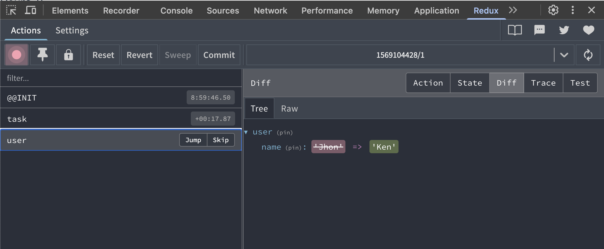

# redux-lite

[English](README.md)

[](https://www.npmjs.com/package/@oldbig/redux-lite)
[](LICENSE)


**一个为 React 量身打造的、零依赖、类型安全、轻量级的状态管理库。**

`redux-lite` 提供了一个现代、简洁且高性能的状态管理方案，旨在通过 TypeScript 提供顶级的开发体验。现在，对您的 React 组件进行单元测试变得简单到超乎想象。

## 核心特性

- **🚀 零依赖**：极其轻量，除了 `react` 作为对等依赖外，无任何第三方运行时依赖。
- **⚡️ 高性能**：通过智能的值比较，从设计上避免不必要的组件重复渲染。
- **✨ 简洁直观的 API**：极简的 API，易于学习和使用。
- **🔒 完全类型安全**：从 store 定义到 dispatchers，提供端到端的类型安全和卓越的自动补全体验。
- **✅ 难以置信的简单测试**：灵活的 Provider 让模拟单元测试的 state 变得轻而易举。
- **🐞 DevTools 就绪**：可选的、零成本的 Redux DevTools 集成，提供顶级的调试体验。

## 安装

```bash
npm install @oldbig/redux-lite
# or
yarn add @oldbig/redux-lite
# or
pnpm add @oldbig/redux-lite
```

## 快速上手

### 1. 定义你的初始 store

创建一个 `storeDefinition` 对象。这个唯一的对象是您整个 state 结构和类型的"真理之源"。

```typescript
// store.ts
import { initiate, optional } from '@oldbig/redux-lite';

export const STORE_DEFINITION = {
  user: {
    name: 'Jhon' as string | null,
    age: 30,
  },
  // 对可能不存在的 state 切片使用 `optional`
  task: optional({ 
    id: 1,
    title: '完成 redux-lite',
  }),
  counter: 0,
};

export const { ReduxLiteProvider, useReduxLiteStore } = initiate(STORE_DEFINITION);
```

### 2. 使用 `Provider` 包装你的应用

在你的主应用文件中，用 `ReduxLiteProvider` 来包装你的组件树。

```tsx
// main.tsx
import React from 'react';
import ReactDOM from 'react-dom/client';
import App from './App';
import { ReduxLiteProvider } from './store';

ReactDOM.createRoot(document.getElementById('root')!).render(
  <React.StrictMode>
    <ReduxLiteProvider>
      <App />
    </ReduxLiteProvider>
  </React.StrictMode>,
);
```

### 3. 在组件中使用 hook

使用 `useReduxLiteStore` hook 来访问 state 切片及其对应的 dispatchers。该 hook 返回一个扁平化的对象，包含所有 state 属性和类型安全的 dispatcher 函数。

```tsx
// MyComponent.tsx
import { useReduxLiteStore } from './store';

const MyComponent = () => {
  // 解构 state 和 dispatchers
  const { 
    user, 
    counter,
    dispatchUser, 
    dispatchPartialUser, 
    dispatchCounter 
  } = useReduxLiteStore();

  return (
    <div>
      <h2>用户: {user.name}</h2>
      <p>计数器: {counter}</p>

      {/* 全量更新 */}
      <button onClick={() => dispatchUser({ name: 'Ken', age: 31 })}>
        设置用户
      </button>

      {/* 部分更新 */}
      <button onClick={() => dispatchPartialUser({ age: 35 })}>
        增加年龄
      </button>

      {/* 函数式更新，可访问整个 store */}
      <button onClick={() => dispatchPartialUser((prev, store) => ({ age: prev.age + store.counter }))}>
        根据计数器增加年龄
      </button>
    </div>
  );
};
```

## API

### `initiate(storeDefinition)`

本库唯一的入口点。

- **`storeDefinition`**: 一个定义了您 store 结构和初始值的对象。
- **返回**: 一个包含 `{ ReduxLiteProvider, useReduxLiteStore }` 的对象。

### `useReduxLiteStore()`

该 hook 返回一个扁平化的对象，其中包含所有 state 切片和 dispatchers。

**Dispatchers**

对于 state 的每一个切片（例如 `user`），都会生成两个 dispatcher：
- `dispatchUser(payload)`: 用于全量更新。
- `dispatchPartialUser(payload)`: 用于部分更新。

`payload` 可以是一个值，也可以是一个函数。如果它是一个函数，它会接收该切片的先前状态作为第一个参数，并接收**整个 store 的 state** 作为第二个参数：`(prevState, fullStore) => newState`。

### `optional(initialValue?)`

一个辅助函数，用于将 state 的某个切片标记为可选的。该 state 属性的类型将被推导为 `T | undefined`。

- **`initialValue`** (可选): 该属性的初始值。如果未提供，则 state 的初始值为 `undefined`。

## 性能

`redux-lite` 为高性能而设计。其内部的 reducer 使用了智能的值比较机制，当数据没有实际改变时，可以有效避免不必要的 state 更新和组件重新渲染。

在一个模拟真实世界场景、重复调用 dispatch 函数的基准测试中，`redux-lite` 能够实现：
- **1,000 次计数器更新约需 15.2 毫秒**
- **1,000 次数组更新约需 2.7 毫秒**
- **10,000 次对象更新约需 45.3 毫秒**

这证明了它即使在包含 React 渲染生命周期的开销下，依然拥有卓越的速度。

## 与 Redux 对比

| 特性         | **Redux (使用 Redux Toolkit)**                           | **redux-lite**                                                |
| ------------ | -------------------------------------------------------- | ------------------------------------------------------------- |
| **模板代码** | 需要 `createSlice`, `configureStore`, actions, reducers。  | 几乎为零。定义一个对象，就能得到你需要的一切。                |
| **API 表面** | API 较多，涉及切片、thunks、selectors 等多个概念。         | 极简。只有 `initiate`, `optional` 和返回的 hook。             |
| **类型安全** | 良好，但 thunks 和 selectors 可能需要手动指定类型。        | **端到端**。所有类型都从初始 store 自动推断。                 |
| **性能**     | 高性能，但依赖记忆化的 selectors (`reselect`)。          | **内置**。如果值深度相等，自动阻止更新。                      |
| **依赖**     | 需要 `@reduxjs/toolkit` 和 `react-redux`。                 | **无**。仅 `react` 作为对等依赖。                             |
| **简洁性**   | 学习曲线较陡峭。                                         | 极其简单。如果你了解 React hooks，你就懂得 `redux-lite`。       |

<details>
<summary>测试你的组件</summary>

`redux-lite` 让测试使用 store 的组件变得极其简单。`ReduxLiteProvider` 接受一个 `initStore` prop，它允许你提供一个深度的部分状态（deep partial state）来覆盖测试的默认初始状态。

这意味着你不再需要派发 action 来设置你期望的测试状态。你可以直接用它所需要的确切状态来渲染你的组件。

### 示例

以下是如何轻松地为你的组件模拟状态：

```tsx
import { render } from '@testing-library/react';
import { initiate } from '@oldbig/redux-lite';
import React from 'react';

// 假设这是你的初始 store 配置
const STORE_DEFINITION = {
  user: { name: 'Guest', age: 0, profile: { theme: 'dark' } },
  isAuthenticated: false,
};

const { ReduxLiteProvider, useReduxLiteStore } = initiate(STORE_DEFINITION);

// --- 你的组件 ---
const UserProfile: React.FC = () => {
  const { user } = useReduxLiteStore();
  return <div>欢迎, {user.name} (主题: {user.profile.theme})</div>;
};

// --- 你的测试 ---
it('应该显示已认证用户的名称，并覆盖了 profile', () => {
  const { getByText } = render(
    <ReduxLiteProvider initStore={{ user: { name: 'Alice', profile: { theme: 'light' } }, isAuthenticated: true }}>
      <UserProfile />
    </ReduxLiteProvider>
  );

  // 组件会使用你提供的确切状态进行渲染
  expect(getByText('欢迎, Alice (主题: light)')).toBeInTheDocument();
});

it('应该浅合并 user 切片并替换嵌套对象', () => {
  const { getByText } = render(
    <ReduxLiteProvider initStore={{ user: { name: 'Bob' } }}>
      <UserProfile />
    </ReduxLiteProvider>
  );

  // user.name 被覆盖，user.age 保持默认，user.profile 不受影响
  expect(getByText('欢迎, Bob (主题: dark)')).toBeInTheDocument();
});
```

你可以轻松地在不同状态下测试你的组件，而无需任何复杂的设置或模拟。

</details>

<details>
<summary>DevTools 集成</summary>

`redux-lite` 提供了与 [Redux DevTools 浏览器插件](https://github.com/reduxjs/redux-devtools) 的可选集成，为您提供顶级的调试体验，包括 action 追踪和时间旅行调试。

该功能默认禁用，在不使用时**性能开销为零**。

**如何启用**

要启用此功能，只需在 `initiate` 函数中传入 `devTools` 选项。

```typescript
// 使用默认配置启用
const { ReduxLiteProvider, useReduxLiteStore } = initiate(STORE_DEFINITION, {
  devTools: true
});

// 或为您的 store 实例提供一个名称
const { ReduxLiteProvider, useReduxLiteStore } = initiate(STORE_DEFINITION, {
  devTools: { name: 'MyAppStore' }
});
```

**安装步骤**

1.  为您的浏览器安装 Redux DevTools 插件：
    *   [Chrome 应用商店](https://chrome.google.com/webstore/detail/redux-devtools/lmhkpmbekcpmknklioeibfkpmmfibljd)
    *   [Firefox 附加组件](https://addons.mozilla.org/en-US/firefox/addon/reduxdevtools/)
2.  如上所示，在您的代码中启用该功能。
3.  打开浏览器的开发者工具，找到 "Redux" 标签页。



</details>


## 支持本项目

如果您觉得 `redux-lite` 对您有帮助，并希望支持本项目的开发，请考虑：

- 在 [GitHub](https://github.com/oldbig/redux-lite) 上给一个 ⭐️
- [请我喝杯咖啡](https://www.buymeacoffee.com/your-link-here)
- <details>
    <summary>通过微信赞赏</summary>
    <br>
    
  </details>

非常感谢您的支持！

## 许可证

本项目采用 MIT 许可证。